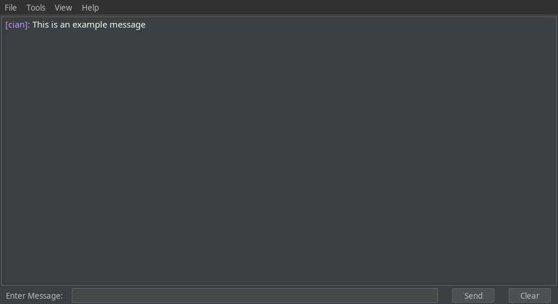

# Dialogue

Local network chat application using Java SealedObjects for encryption. Allows for secure and easy communication on the local network by using [JGroups](https://github.com/belaban/JGroups) for reliable messaging. Any messages sent from one client will appear on other clients that are also online.

# Features

* Send text and links
  * Uses \n and \t for string formatting
* Transfer files
* Generate new symmetric keys and sync these with other devices on the network
* View the devices connected to the channel
* Save the chat transcript

# Screenshot

# Libraries

[JGroups](https://github.com/belaban/JGroups) used for reliable group communication.

[FlatLaf](https://www.formdev.com/flatlaf/) used for GUI theming.
